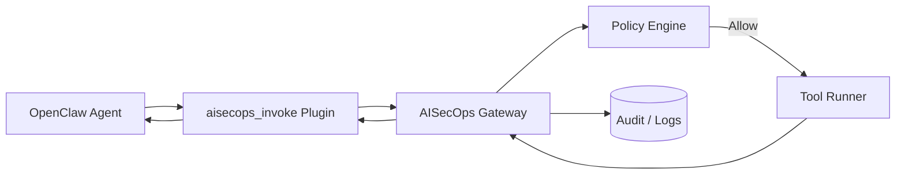

# AISecOps OpenClaw Plugin


Enterprise Tool Adapter for routing OpenClaw tool execution through an external **AISecOps Gateway** (policy + audit + sandbox enforcement).

---

## 🔗 Related Project: AISecOps Runtime Gateway Hybrid

This plugin was originally developed alongside the **AISecOps Runtime Gateway Hybrid** proof‑of‑concept:

https://github.com/viplavfauzdar/aisecops-runtime-gateway-hybrid

In that architecture:

```
OpenClaw → aisecops-openclaw-plugin → AISecOps Runtime Gateway → Policy Engine → Tool Runner
```

The gateway repository provides the backend services responsible for:

- Policy evaluation
- Risk scoring
- Approval workflows
- Tool execution sandboxing
- Audit logging
- Correlation ID propagation

The OpenClaw plugin acts as a **thin transport adapter** that forwards tool requests from OpenClaw to the AISecOps runtime gateway.

### Current Direction

The gateway project served as the **initial proof‑of‑concept backend**.  
Current development is moving toward a more **framework‑agnostic AISecOps Interceptor**, which will support multiple agent frameworks such as:

- OpenClaw
- LangGraph
- CrewAI
- Custom agent runtimes

In that model:

```
Agent Framework
      ↓
AISecOps Interceptor
      ↓
Policy Engine / Risk / Approval
      ↓
Tool Execution
```

The OpenClaw plugin remains a supported **integration adapter** within this broader architecture.

---

## 🎯 Purpose

This plugin turns OpenClaw into a **policy‑aware enterprise agent** by:

- Intercepting tool calls
- Forwarding them to an AISecOps service
- Enforcing policy decisions
- Preserving correlation IDs for audit
- Returning structured results to OpenClaw

Instead of calling tools directly, OpenClaw calls:

```
aisecops_invoke
```

Which forwards execution to:

```
POST /api/v1/tools/invoke
```

---

## 🏗 Architecture Overview



**Flow Summary**

1. OpenClaw invokes `aisecops_invoke`
2. Plugin forwards request to AISecOps Gateway
3. Gateway evaluates policy
4. If approved → Tool Runner executes
5. Response returned with correlation ID
6. Audit trail stored server-side

The plugin is a thin transport layer. All enforcement lives server-side.

---

## 📦 Installation (Local Development)

Clone the repo:

```
git clone https://github.com/viplavfauzdar/aisecops-openclaw-plugin.git
```

Update `~/.openclaw/openclaw.json`:

```json
"plugins": {
  "allow": [
    "aisecops-openclaw-plugin"
  ],
  "load": {
    "paths": [
      "/Users/<your-user>/Projects/aisecops-openclaw-plugin"
    ]
  },
  "entries": {
    "aisecops-openclaw-plugin": {
      "enabled": true,
      "config": {
        "baseUrl": "http://localhost:8083"
      }
    }
  }
}
```

Restart OpenClaw:

```
openclaw gateway
```

Verify:

```
openclaw plugins list
```

---

## 🧪 Example Usage

Prompt OpenClaw:

```
Use the tool aisecops_invoke with toolName="ping" and args={}
```

Example payload sent to AISecOps:

```json
{
  "toolName": "ping",
  "args": {},
  "actor": "openclaw",
  "correlationId": "cid-123"
}
```

---

## 🔐 Environment Variables

| Variable | Description |
|----------|-------------|
| `AISECOPS_BASE_URL` | Override gateway base URL |
| `AISECOPS_INVOKE_PATH` | Override endpoint path (default `/api/v1/tools/invoke`) |
| `AISECOPS_TOKEN` | Adds `Authorization: Bearer` header |
| `AISECOPS_API_KEY` | Adds `x-api-key` header |
| `AISECOPS_TIMEOUT_MS` | Request timeout (default 15000) |

Plugin config takes precedence over env variables.

---

## 🏢 Enterprise Deployment

### Production Recommendations

- Deploy AISecOps Gateway behind TLS (HTTPS only)
- Require API keys or OAuth tokens
- Enable structured audit logging
- Use correlation IDs for traceability
- Restrict allowed tools via policy engine
- Monitor via centralized logging (e.g., ELK, Datadog, Splunk)

### Secure Configuration Example

```json
"config": {
  "baseUrl": "https://aisecops.company.com"
}
```

With environment secrets:

```
AISECOPS_TOKEN=<secure-token>
```

---

## 🧾 Tool Definition

Tool name:

```
aisecops_invoke
```

Required parameters:

- `toolName` (string)

Optional parameters:

- `args` (object)
- `actor` (string)
- `correlationId` (string)
- `dryRun` (boolean)

---

## 🛠 Development

Local packaging:

```
npm pack
npm install -g ./aisecops-openclaw-plugin-0.1.0.tgz
```

---

## 🤝 Contributing

1. Fork the repository
2. Create a feature branch
3. Submit a pull request
4. Ensure changes maintain backward compatibility
5. Include tests where applicable

---

## 🔒 Security

If you discover a security vulnerability, please:

- Do **not** open a public issue
- Email the maintainer directly
- Provide reproduction steps and impact assessment

Security fixes will be prioritized.

---

## 🏷 Versioning

This project follows **Semantic Versioning (SemVer)**:

- MAJOR: breaking changes
- MINOR: new features
- PATCH: bug fixes

---

## 🚀 Roadmap

- Policy preview mode (dry-run enforcement)
- Risk scoring headers
- Structured denial responses
- Multi-tenant routing
- Signed requests
- Metrics instrumentation

---

## 📜 License

MIT